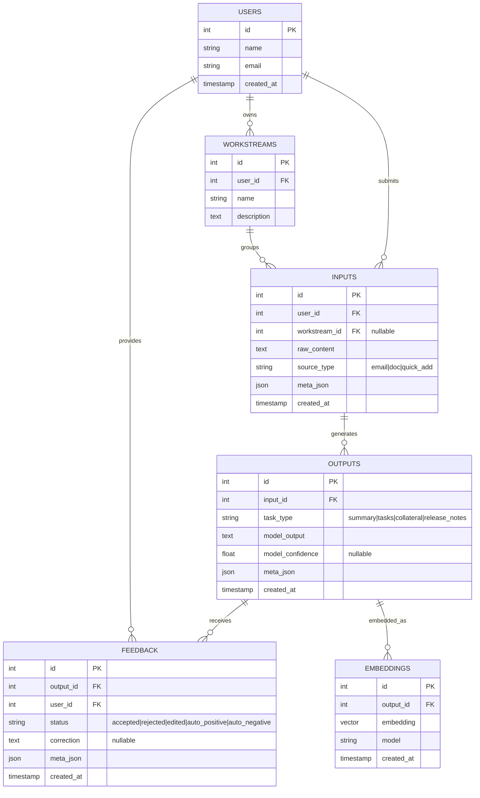

# ReleaseIt.ai — PRD: Feedback & Global Model Improvement

## 1. Overview

### Problem  
Product managers (especially ADHD-leaning PMs) are constantly overwhelmed by email noise, scattered docs, and tasks across multiple workstreams. AI helps automate task extraction, summaries, and collateral, but unless it adapts to user corrections, PMs end up redoing work. Worse, if feedback loops are heavy-handed (constant confirmations), they add to the burden instead of reducing it.  

### Solution  
Introduce a **lightweight feedback + learning system** that:  
- Captures feedback *passively* (checking off, ignoring, or deleting tasks).  
- Allows *inline corrections* (✅ accept, ✏️ edit, 🗑 reject).  
- Occasionally prompts with a **non-intrusive recap**.  
- Stores corrections in a **global feedback pool** (Postgres + pgvector).  
- Uses retrieval-augmented prompting (RAG) so all users immediately benefit.  
- Transparently reassures users that ReleaseIt is *learning from them*, without nagging.  

**Key Principle:** *Feedback should be a natural side effect of usage, not an extra task.*  

---

## 2. Goals & Success Criteria

**Goals**
1. Reduce PM cognitive load while improving accuracy of AI outputs.  
2. Collect feedback signals without interrupting flow.  
3. Apply corrections across the app so all PMs benefit.  
4. Build a high-quality dataset for future fine-tuning.  

**Success Metrics**
- ≥ 70% of outputs accepted without edit.  
- ≥ 25% of rejected/edited outputs lead to improved results in next 2 similar cases.  
- ≥ 3 feedback signals captured per user/day.  
- Users report ReleaseIt “feels smarter over time.”  

---

## 3. User Stories

- *As a PM*, I want AI outputs to be trusted by default so I don’t feel extra burden.  
- *As a PM*, I want to quickly correct tasks inline with one gesture.  
- *As a PM*, I want the system to remember my edits so I don’t repeat them.  
- *As a PM*, I want occasional, lightweight recaps that help me confirm priorities.  
- *As a PM*, I want my feedback to improve the tool for everyone, not just me.  

---

## 4. UX Flows

### Inline Feedback
- ✅ Accept → default (no interaction needed).  
- ✏️ Edit → inline text edit captured as correction.  
- 🗑 Reject → marks as incorrect, stored in feedback table.  

### Passive Feedback
- Task completed → positive signal.  
- Task deleted → negative signal.  
- Task ignored >7 days → auto-negative signal.  

### Recap Feedback
- Morning or end-of-day brief:  
  - “Here’s what I pulled from yesterday. Did I miss anything?”  
- Lightweight accept/edit.  
- Transparent messaging:  
  - “Thanks! ReleaseIt will apply this learning going forward.”  

---

## 5. Technical Architecture

### ERD (Global Feedback Pool)



---

### Retrieval & Prompting Flow

```mermaid
flowchart TD
    A[New Input (email/doc/paste)] --> B[Store INPUT]
    B --> C[Call GPT-4o/Claude to generate OUTPUT]
    C --> D[Store OUTPUT + EMBEDDING]
    D --> E[Render to user (trusted default)]

    %% Feedback
    E --> F[Inline action: ✅/✏️/🗑]
    E --> G[Passive signals: complete/delete/ignore]
    F --> H[Store FEEDBACK + optional correction]
    G --> H[Store FEEDBACK (auto signals)]

    %% Retrieval for future
    A --> I[Embed new input]
    I --> J[Query pgvector: top N global corrected outputs]
    J --> K[Inject examples into prompt as few-shot corrections]
    K --> C
```

---

### Table Field Suggestions

**FEEDBACK**  
- `status`: accepted | rejected | edited | auto_positive | auto_negative  
- `correction`: optional (stores edits)  
- `meta_json`: origin (inline, recap, passive)  

**EMBEDDINGS**  
- `embedding`: pgvector field  
- `model`: which embedding model used  
- `content_hash`: optional for deduplication  

---

### Prompt Assembly Pattern

```
You are ReleaseIt.ai, an assistant for PMs.
Learn from prior user corrections.

Examples of corrections from users:
[EXAMPLE 1]
Input: {{retrieved_input_1}}
Corrected Output: {{retrieved_output_1}}

[EXAMPLE 2]
Input: {{retrieved_input_2}}
Corrected Output: {{retrieved_output_2}}

Now apply this to the new input:
Input: {{new_input}}

Output (JSON):
{ ... }
```

- Inject top 3 globally relevant corrections.  
- Sanitization: strip PII before storing/reusing examples.  

---

## 6. Non-Functional Requirements
- **Performance:** Retrieval + injection adds <500ms latency.  
- **Scalability:** Must handle 100k+ feedback rows in global pool.  
- **Security:** Encrypt all feedback + embeddings. Sanitize PII for reuse.  
- **Accessibility:** Inline controls keyboard-friendly, ARIA labels.  

---

## 7. Rollout Plan

**Phase 1 (MVP, 4–6 weeks)**  
- Inline feedback (✅/✏️/🗑).  
- Passive task feedback capture.  
- Feedback + embeddings tables.  
- Global retrieval injection.  

**Phase 2 (6–10 weeks)**  
- Daily recap UX.  
- Transparency messages (“ReleaseIt is learning from your feedback”).  

**Phase 3 (Future)**  
- Aggregate feedback metrics dashboard.  
- Fine-tuning on global dataset.  
- Per-user personalization layered on global base.  

---

✅ This PRD defines how ReleaseIt will capture, store, and leverage feedback in a natural way while reducing PM cognitive load.  
